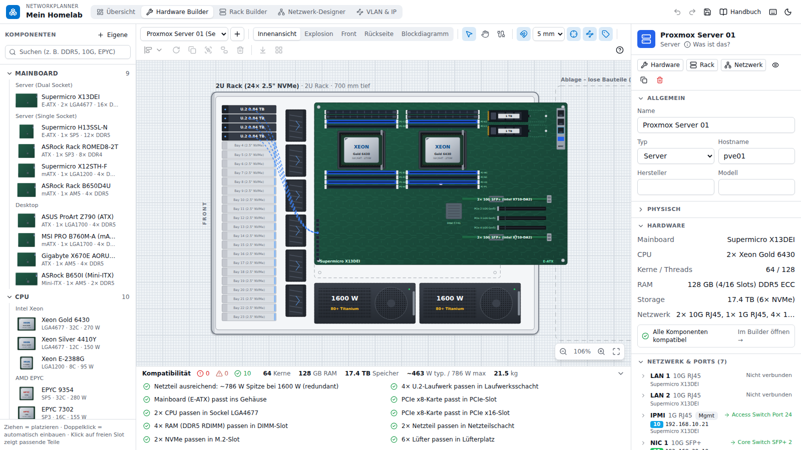
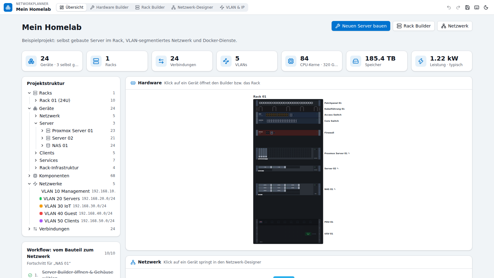
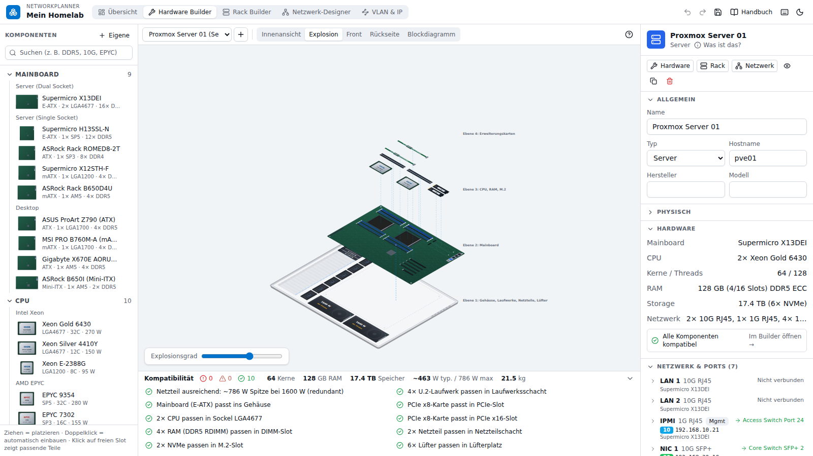
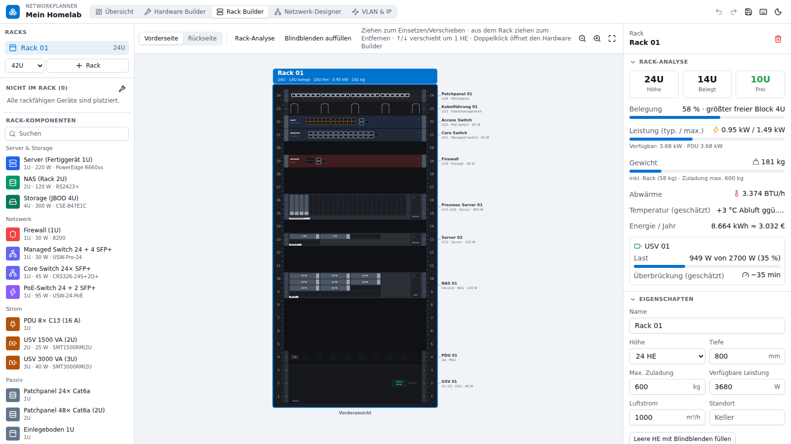
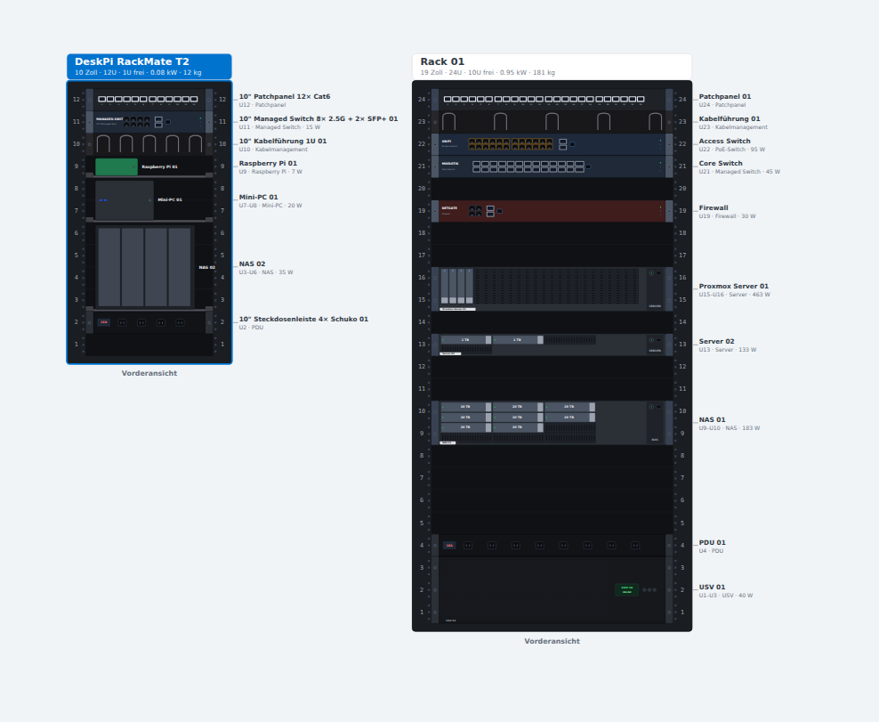
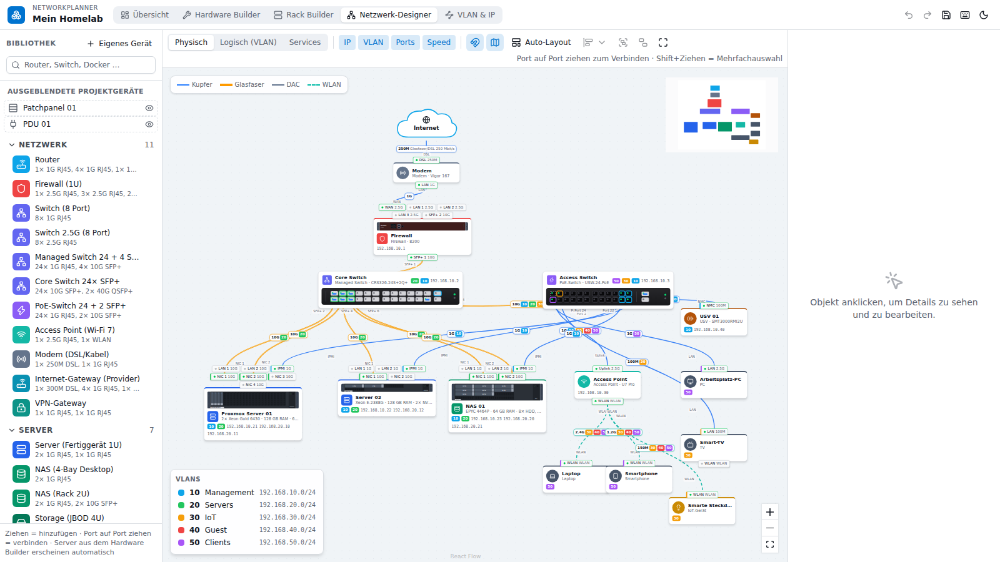
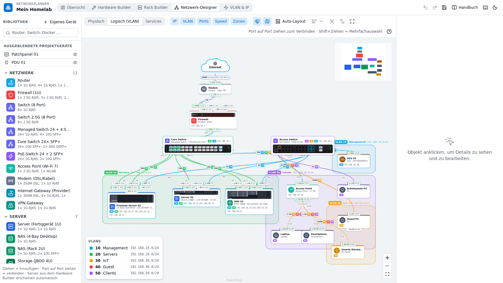
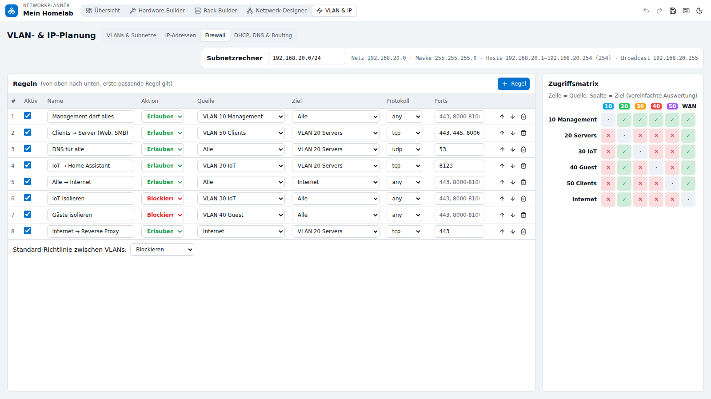

# NetworkPlanner – Handbuch

Dieses Handbuch erklärt Schritt für Schritt, wie du mit dem NetworkPlanner Server zusammenbaust,
in ein Rack einsetzt und im Netzwerk verbindest. Du brauchst keine Vorkenntnisse – Fachbegriffe
werden im Abschnitt [Grundlagen](#grundlagen) und im [Glossar](#glossar) erklärt.

> **Tipp:** In der App öffnest du dieses Handbuch jederzeit über **Handbuch** oben rechts oder über
> das **?** in der Werkzeugleiste des jeweiligen Bereichs – dann springt es direkt zum passenden Kapitel.

## Was ist der NetworkPlanner? {#start}

Der NetworkPlanner ist ein digitaler Baukasten für deine IT-Infrastruktur – vom einzelnen
Arbeitsspeicher-Riegel bis zum kompletten Heimnetz. Er besteht aus fünf Bereichen, die du oben in der
Leiste umschaltest:

| Bereich | Wofür |
| --- | --- |
| **Übersicht** | Alles auf einen Blick: Geräte, Racks, Netzwerk, Warnungen und nächste Schritte |
| **Hardware Builder** | Server, NAS oder PC aus Einzelteilen zusammenbauen (Gehäuse, Mainboard, CPU, RAM, Laufwerke, Karten, Netzteile) |
| **Rack Builder** | Geräte in 19-Zoll- oder 10-Zoll-Racks einsetzen und Strom, Gewicht und Wärme prüfen |
| **Netzwerk-Designer** | Geräte an ihren echten Ports verkabeln, Dienste und Container einzeichnen |
| **VLAN & IP** | Netze (VLANs), IP-Adressen, DHCP, DNS, Firewall-Regeln und Routen planen |

Das Besondere: **Alles ist ein und dasselbe Objekt.** Ein Server, den du im Hardware Builder baust, steckt
genau so im Rack und erscheint im Netzwerk-Designer mit genau den Netzwerkanschlüssen, die du ihm als
Netzwerkkarte eingebaut hast. Änderst du etwas an einer Stelle, ist es überall aktuell.

## Schnellstart in 5 Minuten {#schnellstart}

1. **Projekt beginnen.** Beim ersten Öffnen erscheint ein Willkommensfenster. Wähle
   **Demo-Homelab öffnen**, um ein fertiges Beispiel anzusehen, oder **Leer beginnen**.
2. **Ersten Server bauen.** Im Hardware Builder oben auf **+** („Neues Gerät bauen“) klicken, ein Gehäuse
   wählen (z. B. *2U Rack*) und **Server erstellen** drücken. Netzteile und Lüfter werden automatisch
   eingesetzt, wenn „Grundausstattung einsetzen“ an ist.
3. **Teile einbauen.** Links in der Bauteil-Bibliothek ein Mainboard suchen und ins Gehäuse ziehen, danach
   CPU, RAM, Laufwerke und eine Netzwerkkarte. Passende Steckplätze leuchten beim Ziehen **grün**.
   Noch schneller: **Doppelklick** auf ein Bauteil baut es in den nächsten passenden Platz ein.
4. **Ins Rack setzen.** Zum **Rack Builder** wechseln, links eine Rack-Vorlage wählen und
   **Rack hinzufügen** klicken. Deinen Server aus „Nicht im Rack“ ins Rack ziehen (oder doppelklicken).
5. **Verkabeln.** Im **Netzwerk-Designer** einen Router und einen Switch aus der Bibliothek auf die Fläche
   ziehen. Dann von einem Port (kleiner Punkt am Gerät) zu einem anderen Port ziehen – fertig ist das Kabel.
6. **IP-Adressen planen.** Unter **VLAN & IP** ein VLAN mit Subnetz anlegen (z. B. `192.168.10.0/24`) und
   bei **IP-Adressen** den Geräten Adressen geben – der Knopf „Nächste freie IP“ hilft dabei.
7. **Sichern.** Alles wird automatisch im Browser gespeichert. Für eine echte Sicherung im Projektmenü
   (oben links auf den Projektnamen klicken) **Projekt exportieren (JSON)** wählen.

## Die Oberfläche {#oberflaeche}



Die App ist in allen Bereichen gleich aufgebaut:

- **Obere Leiste**
  - Links der **Projektname** – ein Klick öffnet das Projektmenü (Neu, Öffnen, Umbenennen, Duplizieren,
    Demo laden, Speichern, Import und Export).
  - In der Mitte die **fünf Bereiche**.
  - Rechts **Rückgängig / Wiederholen**, **Speichern** (gelb = es gibt noch nicht gesicherte Änderungen),
    **Handbuch**, **Tastaturkürzel** und **Hell/Dunkel**.
- **Links: Bibliothek.** Alles, was du hinzufügen kannst. Oben gibt es immer ein Suchfeld.
- **Mitte: Arbeitsfläche.** Hier baust, ziehst und verbindest du.
  - **Zoomen:** Mausrad oder die Lupen-Knöpfe. **0** passt alles ins Bild.
  - **Ansicht verschieben:** Leertaste gedrückt halten und ziehen, mittlere Maustaste oder das Hand-Werkzeug.
- **Rechts: Inspector.** Zeigt die Eigenschaften dessen, was du angeklickt hast, und lässt sie dich ändern.
  Oben im Inspector springst du mit **Hardware**, **Rack** und **Netzwerk** direkt zu demselben Gerät in den
  anderen Bereichen.
- **„Was ist das?“** – Das kleine **ⓘ** neben Bauteilen und Gerätetypen erklärt in einfachen Worten, wofür
  das Teil gut ist.
- **Meldungen** erscheinen unten rechts. Viele haben einen Knopf **Rückgängig**.

## Übersicht {#uebersicht}



Die Übersicht fasst dein Projekt zusammen:

- **Kennzahlen** – Geräte, Racks, Verbindungen, VLANs, CPU-Kerne, RAM, Speicher und Leistung. Gibt es
  Kompatibilitätsprobleme, steht dort die Zahl der **Hinweise**. Geräte, Racks, Verbindungen und VLANs lassen
  sich anklicken und führen in den passenden Bereich.
- **Projektstruktur** – ein Baum aller Geräte, Racks, VLANs und Verbindungen. Ein Klick springt zum Objekt.
- **Workflow** – eine Checkliste der typischen Schritte („Server Builder öffnen & Gehäuse wählen“,
  „Mainboard hineinziehen“, „CPU einsetzen“ … bis „VLAN zuweisen“). Erledigte Schritte werden abgehakt.
- **Hardware** und **Netzwerk** – kleine Vorschau aller Racks und des Netzwerks. Ein Klick auf ein Gerät öffnet
  es im jeweiligen Editor.

## Hardware Builder {#hardware}

Im Hardware Builder baust du ein Gerät aus Einzelteilen – so, wie du es in der Realität zusammenschrauben würdest.

### Neues Gerät anlegen {#gehaeuse}

Oben in der Werkzeugleiste auf **+** („Neues Gerät bauen“) klicken. Wähle:

- **Gerätetyp** – Server, NAS, Workstation, PC …
- **Name** – z. B. `Proxmox 01`.
- **Gehäuse**

| Gehäuse | Typisch für |
| --- | --- |
| Tower (Midi-ATX) | PC, Workstation, Homeserver unterm Schreibtisch |
| 1U Rack | flacher Server, 4 × 3,5" |
| 2U Rack | der Allrounder, 12 × 3,5" |
| 2U Rack (24 × 2,5" NVMe) | All-Flash-Server |
| 10" 2U Mini-ITX | kleiner Server für ein 10-Zoll-Mini-Rack (siehe [10-Zoll-Racks](#zehn-zoll)) |
| 10" 2U HDD-Einschub | Festplattengehäuse **ohne Mainboard** für Mini-Racks, 4 × 3,5" |
| 4U Rack | Storage-Server mit 24 Schächten, Platz für Grafikkarten |
| 2U JBOD (12 × 3,5") | Festplatten-Erweiterung **ohne Mainboard**, per SAS-Kabel am Server |
| Custom | alles selbst festlegen: Höhe **1–12 HE**, Rackbreite 19"/10", Schächte, Netzteile, Lüfter, Mainboard-Formate – oder „Nur Festplattengehäuse“ |

Mit **Grundausstattung einsetzen** werden passende Netzteile und Lüfter gleich eingebaut.
Die Gehäusewerte kannst du später im Inspector unter **Gehäuse** jederzeit ändern.

### Bauteile einbauen {#einbauen}

Es gibt drei Wege, ein Teil einzubauen:

1. **Ziehen:** Bauteil aus der Bibliothek auf den Steckplatz ziehen.
2. **Doppelklick** in der Bibliothek: Das Teil wandert automatisch in den nächsten passenden freien Platz.
3. **Auf einen freien Steckplatz klicken:** Der Inspector zeigt nur die Teile, die dort hineinpassen –
   ein Klick setzt sie ein.

Beim Ziehen zeigen Farben, ob es passt:

- **Grün** – passt.
- **Gelb** – passt mit Einschränkung (z. B. Karte läuft langsamer, als sie könnte).
- **Rot** – passt nicht. Die Begründung steht direkt am Mauszeiger, z. B.
  *„Diese CPU benötigt Sockel AM5, das Mainboard hat LGA1700“*.

Wichtig: Manche Teile sitzen **auf dem Mainboard** (CPU, RAM, M.2-SSD, PCIe-Karten). Baue deshalb zuerst das
Mainboard ein. Laufwerke gehören in die **Laufwerksschächte**, Netzteile in die **Netzteilschächte**.

Nicht eingebaute Teile liegen in der **Ablage** neben dem Gehäuse. Mit „Lose Bauteile automatisch einbauen“
versucht die App, alle auf einmal unterzubringen.

### Werkzeuge und Bearbeiten {#hw-werkzeuge}

| Werkzeug / Aktion | So geht's |
| --- | --- |
| Auswählen & verschieben | **V** – anklicken, ziehen. Mehrere: Shift-Klick oder Rahmen ziehen |
| Ansicht verschieben | **H** oder Leertaste gedrückt halten |
| Interne Verbindung | **C** – z. B. von einer Festplatte zu einem HBA-Controller ziehen |
| Drehen | **R** (90°), beim Ziehen am Drehgriff in 15°-Schritten, Shift = frei |
| Duplizieren / Löschen | Strg+D / Entf |
| Gruppieren | Strg+G, aufheben mit Strg+Shift+G |
| Einrasten und Hilfslinien | in der Werkzeugleiste an-/ausschalten; **Alt** beim Ziehen deaktiviert sie kurz |
| Ausbauen / Einbauen | **U** / **I** |

Laufwerke werden automatisch am passenden Anschluss (SATA, HBA/RAID, NVMe-Backplane) angeschlossen.
Mit dem Verbindungs-Werkzeug kannst du das selbst festlegen.

### Ansichten {#hw-ansichten}

- **Innenansicht** – von oben ins offene Gehäuse. Hier baust du.
- **Explosion** – schräge 3D-artige Ansicht, bei der die Teile auseinandergezogen sind. Den Abstand stellst du
  mit dem Regler ein.
- **Front** und **Rückseite** – so sieht das Gerät im Rack aus. Auf der Rückseite siehst du alle
  Netzwerkanschlüsse und darunter, womit sie verbunden sind.
- **Blockdiagramm** – wer ist womit verbunden: CPU → Mainboard → RAM, NVMe, Netzwerkkarten → Switch.



### Kompatibilitätsprüfung {#kompatibilitaet}

Unter der Arbeitsfläche siehst du die Prüfung in Echtzeit: **rot** = Fehler, **gelb** = Warnung,
**grün** = in Ordnung. Geprüft werden unter anderem:

- CPU-Sockel, RAM-Generation (DDR4/DDR5), RDIMM/UDIMM, ECC und Takt
- PCIe-Steckplätze: Länge, Lanes, Generation, Low-Profile, Kartenlänge, Grafikkarten über mehrere Slots
- M.2-Länge und -Protokoll, 2,5"/3,5"/U.2-Schächte, freie Controller-Anschlüsse
- Netzteil: reicht die Leistung? Sind sie redundant?
- Fehlende Teile (kein Mainboard, keine CPU, kein Boot-Laufwerk, keine Netzwerkkarte …)

Klicke auf eine Meldung, um das betroffene Teil auszuwählen.

### Eigene Bauteile und Vorlagen {#eigene}

Fehlt ein Teil? In der Bauteil-Bibliothek oben auf **+ Eigene** klicken. Du kannst ein vorhandenes Teil als
Vorlage nehmen und die Werte (Name, Hersteller, Leistung, Größe, technische Daten) ändern. Eigene Teile landen in
der Gruppe **Eigene** und werden mit dem Projekt gespeichert.

## Rack Builder {#rack}



### Rack anlegen {#rack-anlegen}

Links unter **Racks** eine Vorlage auswählen und **Rack hinzufügen** klicken:

| Vorlage | Beschreibung |
| --- | --- |
| 19" · 42 HE Serverschrank | Standard-Serverschrank, 600 × 1000 mm |
| 19" · 24 HE | halbhoher Schrank |
| 19" · 12 HE Wandschrank | Wandverteiler |
| 10" · 12 HE DeskPi RackMate T2 | offenes 10-Zoll-Mini-Rack (siehe [10-Zoll-Racks](#zehn-zoll)) |
| 10" · 8 HE / 10" · 6 HE | kleine 10-Zoll-Racks und Wandgehäuse |

Alle Werte kannst du danach rechts im Inspector ändern: **Name, Rackbreite (19"/10"), Höhe, Tiefe,
Außenbreite, Leergewicht, maximale Zuladung, verfügbare Leistung, Luftstrom, Standort und Notizen.**

### Geräte einsetzen, verschieben, entfernen {#rack-bedienen}

- **Einsetzen:** Gerät aus „Nicht im Rack“ oder eine Komponente aus der Liste auf die gewünschte Höhe ziehen.
  Ein grüner Rahmen zeigt, wo es landet (z. B. *U12–U13 ✓*). Rot bedeutet: belegt, zu groß oder passt nicht
  (der Grund steht daneben). **Doppelklick** setzt das Gerät in den nächsten freien Platz des ausgewählten Racks.
- **Verschieben:** Gerät im Rack anklicken und ziehen – auch in ein anderes Rack. Mit **↑/↓** bewegst du ein
  ausgewähltes Gerät um eine Höheneinheit.
- **Entfernen:** Gerät aus dem Rack hinaus ziehen oder **Entf** drücken. Das Gerät bleibt im Projekt, es steckt
  nur nicht mehr im Rack. **Shift+Entf** löscht es ganz.
- **Vorderseite / Rückseite** schaltet die Ansicht um. Geräte, die hinten montiert sind, werden vorne blass gezeigt.
- **Doppelklick** auf einen selbst gebauten Server öffnet ihn im Hardware Builder.
- **Blindblenden auffüllen** füllt alle freien Höheneinheiten mit Blenden (wichtig für den Luftstrom).
- **Tischgeräte** wie Mini-PC, Raspberry Pi oder ein kleines NAS stehen im Rack auf einem **Einlegeboden**. Sie
  haben eine Höhe in HE (z. B. Mini-PC = 2 HE), damit sie ins Rack gestellt werden können. In der Liste sind sie
  mit **Boden** markiert.

### Rack-Analyse {#rack-analyse}

Klicke auf die Kopfzeile eines Racks oder auf **Rack-Analyse**. Rechts siehst du:

| Wert | Bedeutung |
| --- | --- |
| Höhe / Belegt / Frei | Höheneinheiten und größter zusammenhängender freier Block |
| Leistung (typ. / max.) | Stromverbrauch aller Geräte, berechnet aus den eingebauten Teilen |
| Gewicht | Geräte plus leeres Rack. Der Balken zeigt die Zuladung im Verhältnis zur maximalen Zuladung |
| Abwärme | in BTU/h – so viel Wärme muss abgeführt werden |
| Temperatur (geschätzt) | wie viel wärmer die Luft hinten herauskommt |
| Energie / Jahr | kWh und ungefähre Stromkosten |
| USV | Auslastung und geschätzte Überbrückungszeit bei Stromausfall |

Darunter stehen **Warnungen**, z. B. „Traglast überschritten“, „Gerät tiefer als das Rack“,
„USV sollte unten eingebaut werden“ oder „19-Zoll-Gerät passt nicht in das 10-Zoll-Rack“.
Ein **!** in der Kopfzeile des Racks zeigt, dass es Warnungen gibt.

## 10-Zoll-Racks (Mini-Racks) {#zehn-zoll}



### Was ist der Unterschied? {#zehn-zoll-unterschied}

„Zoll“ meint die **Breite der Frontplatte** – nicht die Höhe. Die Höhe wird in **Höheneinheiten (HE, englisch U)**
gemessen, 1 HE = 44,45 mm. Das gilt für beide Größen gleich.

| | 19 Zoll | 10 Zoll |
| --- | --- | --- |
| Breite der Frontplatte | 482,6 mm | 254 mm |
| Platz zwischen den Schienen | ca. 450 mm | ca. 222 mm |
| Typische Geräte | Server, 24/48-Port-Switches, USV | kleine Switches, Patchpanel, Mini-PCs, Raspberry Pi |

Die App prüft das automatisch:

- Ein **19-Zoll-Gerät passt nicht in ein 10-Zoll-Rack.** Beim Ziehen wird der Platz rot und du bekommst den Hinweis
  *„… ist ein 19-Zoll-Gerät (ca. 48 cm breit) und passt nicht in das 10-Zoll-Rack“*.
- Ist ein 10-Zoll-Rack ausgewählt, zeigt die Bibliothek **nur Teile, die hineinpassen**. Alles andere liegt
  eingeklappt unter „Passt nicht in …“ – so siehst du trotzdem, was es gibt.
- **10-Zoll-Geräte passen auch in ein 19-Zoll-Rack.** Die App zeichnet dann links und rechts Adapterbleche
  („10"→19"“) – so wie in der Realität mit einem Adapter-Winkel.
- Tischgeräte werden nach ihrer **Breite** geprüft (Inspector → Physisch → Breite).

### Beispiel: DeskPi RackMate T2 einrichten {#deskpi}

Der DeskPi RackMate T2 ist ein offenes 10-Zoll-Rack mit 12 Höheneinheiten.

1. **Rack Builder** öffnen.
2. Links in der Vorlagenliste **10" · 12 HE DeskPi RackMate T2** wählen und **Rack hinzufügen** klicken.
3. Die Vorlage trägt ein: 10 Zoll, 12 HE, ca. 280 × 260 mm, Leergewicht 6,9 kg.
   **Maximale Zuladung:** Der Hersteller nennt keinen Wert – die Vorlage nimmt vorsichtig **30 kg** an.
   Wenn du einen genaueren Wert kennst, trage ihn im Inspector ein.
4. Komponenten aus der Gruppe **10"** hineinziehen oder doppelklicken.

So könnte eine Belegung der 12 HE aussehen:

| HE | Gerät |
| --- | --- |
| U12 | 10" Patchpanel 12 × Cat6 |
| U11 | 10" Switch 8 Port (oder Managed Switch) |
| U10 | 10" Kabelführung |
| U9 | Raspberry Pi (auf 10"-Halterung oder Einlegeboden) |
| U7–U8 | Mini-PC auf Einlegeboden |
| U3–U6 | kleines NAS (4 Schächte) auf Einlegeboden |
| U2 | frei / Blindblende |
| U1 | 10" Steckdosenleiste |

Schwere Geräte gehören nach **unten**, Patchpanel und Switch nach **oben** – dann sind die Kabelwege kurz.

### Eigener 10-Zoll-Server {#zehn-zoll-server}

Im Hardware Builder gibt es das Gehäuse **10" 2U Mini-ITX**: Mini-ITX-Mainboard, 2 × 3,5" und 2 × 2,5",
ein **SFX-Netzteil** (normale Server-Netzteile passen nicht), zwei 60-mm-Lüfter und eine Low-Profile-Karte.
Mit **Custom** kannst du auch eigene 10-Zoll-Gehäuse anlegen: dort **Rackbreite → 10 Zoll** wählen.

### Worauf du achten solltest {#zehn-zoll-tipps}

- **Tiefe:** Mini-Racks sind oft nur 20–30 cm tief. Ist ein Gerät tiefer, warnt die Rack-Analyse.
- **Gewicht:** Die Zuladung kleiner Racks ist begrenzt – ein Blick auf den Gewichtsbalken lohnt sich.
- **Strom:** Netzteile von Mini-PCs und Raspberry Pis brauchen Steckdosen – eine 10"-Steckdosenleiste einplanen.

## Wenn ein Teil fehlt {#fehlende-teile}

Die Bibliotheken enthalten viele gängige Teile, aber nicht jedes Modell. Fehlt etwas, legst du es selbst an –
danach verhält es sich wie jedes andere Teil (Rack, Gewicht, Strom, Ports, Prüfung). Welcher Weg passt, hängt
davon ab, **was** fehlt:

| Was fehlt? | Weg |
| --- | --- |
| Ein Bauteil **im** Server (CPU, SSD, Netzwerkkarte, Lüfter …) | Hardware Builder → Bibliothek → **+ Eigene** → Reiter *Bauteil* |
| Ein Mainboard | **+ Eigene** → Reiter *Mainboard* (die Steckplätze werden automatisch erzeugt) |
| Ein Gehäuse mit anderen Schächten | **Custom**-Gehäuse beim Anlegen oder im Inspector unter *Gehäuse* ändern |
| Ein eigenständiges Rack-Gerät (Switch, USV, fertiges NAS …) | Rack Builder → **Eigenes Rack-Gerät anlegen** (oder Netzwerk-Designer → **+ Eigenes Gerät**) |
| Ein Festplatten-Einschub / JBOD, in den du selbst Platten steckst | Hardware Builder → Gehäuse **10" 2U HDD-Einschub**, **2U JBOD** oder **Custom** mit *Nur Festplattengehäuse* |

Im Rack Builder findest du unten in der Teileliste den Kasten **„Passendes Teil nicht dabei?“** mit den beiden
wichtigsten Wegen.

### Beispiel: Festplatten-Einschub für den eigenen Server {#hdd-einschub}

Viele Mini-Rack-Server bestehen aus zwei Teilen: dem eigentlichen Server (Mainboard, CPU, RAM) und einem
separaten **Festplatten-Einschub**, dessen Platten per SATA- oder SAS-Kabel am Server hängen.

1. Hardware Builder → **+** („Neues Gerät bauen“).
2. Gehäuse **10" 2U HDD-Einschub** wählen (4 × 3,5"). Der Gerätetyp springt auf *Storage*.
   Passt die Vorlage nicht, **Custom** wählen, **Nur Festplattengehäuse (ohne Mainboard)** einschalten und
   Rackbreite, Höhe (HE), Zahl der 3,5"/2,5"-Schächte, Lüfter und Netzteile selbst eintragen.
3. **Erstellen** – das Gehäuse hat keine Mainboard-Fläche, nur Schächte.
4. Festplatten aus der Bibliothek in die Schächte ziehen (oder doppelklicken). Kapazität, Gewicht und Strom werden
   mitgerechnet. Die Prüfung meldet **kein** fehlendes Mainboard, sondern nur den Hinweis „Laufwerksgehäuse ohne Mainboard“.
5. Im **Rack Builder** den Einschub aus „Nicht im Rack“ direkt unter oder über den Server ziehen.
6. Hat der Einschub kein eigenes Netzteil (Strom kommt vom Server), lass *Netzteile* auf 0.

Die Kabelverbindung zwischen Einschub und Server wird nicht als Netzwerkverbindung gezeichnet – notiere sie bei Bedarf
im Inspector unter *Notizen*. Im Server selbst brauchst du genug SATA-Anschlüsse oder eine HBA-Karte
(bei SAS / JBOD eine HBA mit externen Anschlüssen).

### Beispiel: fertiges Gerät, das es nicht gibt {#eigenes-geraet}

Für Geräte, die du nicht zerlegen willst (z. B. ein bestimmter 10"-Switch oder ein fertiges NAS):

1. Rack Builder → **Eigenes Rack-Gerät anlegen** (öffnet direkt den Reiter *Gerät*).
2. Name, Typ (z. B. *NAS* oder *Storage*) und Bauform eintragen:
   - **Rack**: Rackbreite **10 Zoll** oder **19 Zoll** und Höhe in HE wählen.
   - **Desktop/Tower**: Breite in mm und bei **Im Rack (Boden)** die Höhe wählen, die es auf dem Einlegeboden belegt.
3. Tiefe, Leistung, Gewicht und bei NAS/Storage die **Laufwerksschächte** angeben.
4. **Ports** festlegen (z. B. 2 × 2,5G RJ45) – sie erscheinen später im Netzwerk-Designer.
5. **Gerät anlegen** – es steht jetzt in der Rack- und in der Netzwerk-Bibliothek unter „Eigene“ bzw. seiner Gruppe.

Unter den Maßen steht, ob das Gerät in ein 10-Zoll-Rack passt. Eigene Vorlagen werden mit dem Projekt gespeichert
und beim JSON-Export mitgenommen.

## Netzwerk-Designer {#netzwerk}



### Geräte hinzufügen {#netz-geraete}

Links in der **Bibliothek** findest du Router, Firewall, Switches, Access Points, Modem, Server, NAS,
Clients (PC, Laptop, Handy, Drucker …) und Dienste (DNS, DHCP, VPN, Reverse Proxy, Docker, VM, Kubernetes,
Cloud, Internet). Ziehe sie auf die Fläche. Deine selbst gebauten Server sind automatisch schon da.

### Ports und Verbindungen {#netz-verbinden}

Jedes Gerät zeigt seine **Ports** als kleine Anschlusspunkte. Bei selbst gebauten Servern stammen sie direkt von
den eingebauten Netzwerkkarten (NIC 1, NIC 2, IPMI …).

- **Verbinden:** Von einem Port zu einem anderen Port ziehen.
- Die **Geschwindigkeit** wird automatisch gesetzt – das langsamere Ende bestimmt das Tempo.
- **Verbindung anklicken** → im Inspector Typ (Ethernet, Glasfaser, DAC, WLAN, WAN, Virtuell …),
  Geschwindigkeit, Kabelkategorie, Länge, Kabelnummer und VLANs festlegen.
- Die Verbindung sieht man an **beiden** Enden: in der Port-Übersicht des Servers *und* des Switches,
  z. B. *„NIC 1 · 10G SFP+ → Core Switch SFP+ 10“*.
- **Rechtsklick** auf ein Gerät öffnet ein Menü: *Im Hardware Builder öffnen*, *Im Rack zeigen*, *Duplizieren*,
  *Gruppieren*, *Aus Ansicht ausblenden* und *Löschen*. Rechtsklick auf ein Kabel: *Eigenschaften* oder *Verbindung löschen*.
- **Doppelklick** auf einen selbst gebauten Server öffnet ihn im Hardware Builder.

### Ansichten und Hilfen {#netz-ansichten}

- **Physisch** – echte Kabel und Medien.
- **Logisch (VLAN)** – farbig nach VLAN, Zonen für Netze.
- **Services** – welche Dienste und Container auf welchem Gerät laufen.
- In der Werkzeugleiste blendest du **IP, VLAN, Ports und Speed** ein und aus.
- **Gruppieren** (Strg+G) fasst Geräte zu einer Zone zusammen, z. B. „DMZ“ oder „Keller“.
- **Auto-Layout** ordnet alles übersichtlich an. **Ausrichten & verteilen** hilft bei mehreren ausgewählten Geräten.
- Die **Mini-Map** oben rechts zeigt, wo du gerade bist. Ausgeblendete Geräte findest du links unter
  „Ausgeblendete Projektgeräte“.



## VLAN & IP {#ipam}



Hier planst du die „logische“ Seite deines Netzes. Oben gibt es vier Reiter und rechts einen **Subnetzrechner**.

### VLANs & Subnetze {#vlans}

**VLAN hinzufügen** klicken und rechts im Inspector eintragen: VLAN-ID (z. B. 10), Name (z. B. „Server“),
Farbe, Subnetz (z. B. `192.168.10.0/24`), Gateway (meist die `.1`) und bei Bedarf **DHCP aktiv** mit Bereich,
DNS-Server und Domain. Die Liste zeigt, wie viele Adressen belegt sind und welche Ports das VLAN nutzen.

### IP-Adressen {#ips}

Eine Tabelle aller Geräte-Anschlüsse. Wähle VLAN und Modus (statisch oder DHCP), trage die IP ein oder nutze
**Nächste freie IP**. Markiert werden: doppelt vergebene Adressen, Adressen außerhalb des Subnetzes,
Netz- und Broadcast-Adressen, die Adresse des Gateways und statische IPs im DHCP-Bereich.

### Firewall {#firewall}

Regeln in der Form *Quelle → Ziel, Protokoll, Port, Erlauben/Blockieren*. Die **Zugriffsmatrix** zeigt
vereinfacht, welches Netz mit welchem sprechen darf (Zeile = Quelle, Spalte = Ziel).

### DHCP, DNS & Routing {#routing}

Übersicht der DHCP-Bereiche, DNS-Einträge (automatisch aus Hostnamen und IPs, plus eigene) und der Routen
deiner Router/Firewalls. **+ Route** fügt eine statische Route hinzu (Zielnetz und Gateway).

## Speichern, Projekte, Import & Export {#speichern}

- **Automatisches Speichern:** Jede Änderung wird nach kurzer Zeit im Browser gespeichert (IndexedDB).
  Das Disketten-Symbol oben wird gelb, solange noch etwas nicht gesichert ist. **Strg+S** speichert sofort.
- **Wichtig:** Die Daten liegen **nur in diesem Browser auf diesem Gerät.** Ein anderer Browser, ein privates Fenster
  oder das Löschen der Website-Daten zeigt ein leeres Projekt. Exportiere deshalb regelmäßig.
- **Projekte:** Projektmenü → **Projekte öffnen …** listet alle gespeicherten Projekte. Dort kannst du öffnen,
  löschen, ein neues Projekt anlegen oder die Demo laden.
- **Export:** Projektmenü → Export. Es öffnet sich ein Fenster mit **Herunterladen** und **Kopieren**:
  - *Projekt (JSON)* – vollständige Sicherung, lässt sich wieder importieren.
  - *Stückliste (CSV)* – alle Geräte und Bauteile, z. B. zum Einkaufen.
  - *Kabelliste (CSV)* – alle Verbindungen mit Ports, Kabeltyp und Länge.
  - *IP-Plan (CSV)* – alle Adressen.
  - *Dokumentation (Markdown)* – lesbare Beschreibung des ganzen Projekts.
  Falls der Browser das Herunterladen blockiert, nimm **Kopieren** und füge den Text in eine Datei ein.
- **Import:** Projektmenü → **Projekt importieren (JSON) …** – Datei auswählen oder den kopierten Text einfügen.
  Das importierte Projekt öffnet sich als neues Projekt, dein aktuelles bleibt erhalten.
- **Rückgängig:** Strg+Z macht fast alles rückgängig (auch Löschen), Strg+Shift+Z oder Strg+Y wiederholt.

## Tastaturkürzel {#tastatur}

Auf dem Mac statt **Strg** die **⌘-Taste** verwenden. Die Liste findest du auch in der App über das Tastatur-Symbol.

| Taste | Aktion |
| --- | --- |
| Strg+Z / Strg+Shift+Z / Strg+Y | Rückgängig / Wiederholen |
| Strg+S | Speichern |
| Strg+C / Strg+V / Strg+X | Kopieren / Einfügen / Ausschneiden |
| Strg+D | Duplizieren |
| Strg+A | Alles auswählen |
| Strg+G / Strg+Shift+G | Gruppieren / Gruppierung aufheben |
| Entf oder Backspace | Löschen (im Rack: aus dem Rack nehmen) |
| Pfeiltasten (mit Shift größer) | Verschieben; im Rack ↑/↓ = 1 HE |
| R / Shift+R | Drehen (Hardware) |
| I / U | Einbauen / Ausbauen (Hardware) |
| V / H / C | Werkzeug Auswahl / Hand / Kabel |
| Leertaste + Ziehen | Ansicht verschieben |
| Mausrad, + / − / 0 | Zoomen, alles einpassen |
| Shift+Klick oder Rahmen | Mehrfachauswahl |
| Alt beim Ziehen | Einrasten kurz aus |
| Esc | Auswahl aufheben |

## Grundlagen: Netzwerk kurz erklärt {#grundlagen}

### Was jedes Heimnetz hat {#grundlagen-heimnetz}

1. **Internetanschluss** – DSL, Glasfaser oder Kabel. Ein **Modem** übersetzt das Signal der Leitung.
2. **Router / Gateway** – verbindet dein Netz mit dem Internet. Er ist das „Tor nach draußen“ und hat meist die
   Adresse `192.168.x.1`.
3. **Switch** – verteilt das Netz per Kabel an mehrere Geräte (wie eine Mehrfachsteckdose fürs Netzwerk).
4. **WLAN-Access-Point** – macht das Netz kabellos verfügbar.
5. **DHCP** – vergibt automatisch IP-Adressen an Geräte.
6. **DNS** – übersetzt Namen wie `example.com` in IP-Adressen.
7. **Endgeräte** – PCs, Handys, Fernseher, Server …

Ein **Telekom Speedport** oder eine **FRITZ!Box** ist all das in einem Gerät: Modem, Router/Gateway,
kleiner Switch, WLAN, DHCP und DNS. Im NetworkPlanner nimmst du dafür am besten den Typ **Gateway**
(oder Router, wenn du ein separates Modem einzeichnest).

### Was ist ein Port? {#grundlagen-ports}

Das Wort hat zwei Bedeutungen:

- **Physischer Port** – die Buchse am Gerät, in die ein Kabel kommt (RJ45 für Netzwerkkabel,
  SFP+ für Glasfaser oder DAC-Kabel). Im NetworkPlanner sind das die Anschlusspunkte an den Geräten.
- **Logischer Port (TCP/UDP)** – eine Nummer, an der ein Dienst lauscht, z. B. 443 für HTTPS oder 22 für SSH.
  Diese Ports trägst du bei den **Firewall-Regeln** ein.

### IP-Adresse, Subnetz und Gateway {#grundlagen-ip}

- Eine **IP-Adresse** ist die „Hausnummer“ eines Geräts im Netz, z. B. `192.168.10.20`.
- Ein **Subnetz** ist die „Straße“: `192.168.10.0/24` bedeutet, alle Adressen von `192.168.10.1` bis
  `192.168.10.254` gehören dazu. Die Zahl hinter dem Schrägstrich (CIDR) sagt, wie groß das Netz ist –
  `/24` = 254 Geräte. Den **Subnetzrechner** findest du unter VLAN & IP.
- Das **Gateway** ist der Router in diesem Subnetz – dorthin schickt ein Gerät alles, was nicht im eigenen Netz ist.

### VLAN {#grundlagen-vlan}

Ein **VLAN** teilt ein physisches Netz in mehrere getrennte logische Netze – z. B. „Server“, „Gäste“ und „IoT“.
Geräte in verschiedenen VLANs können nur über den Router/die Firewall miteinander sprechen. Ein Port, der
mehrere VLANs transportiert (meist zwischen Switch und Router), heißt **Trunk**.

## Häufige Fragen & Probleme {#faq}

**Ich kann `http://localhost:5173` nicht öffnen.**
Diese Adresse funktioniert nur auf dem Rechner, auf dem die App gerade gestartet wurde. Um sie bei dir laufen
zu lassen: [Node.js](https://nodejs.org) ab Version 22.12 installieren, das Projekt herunterladen und im
Projektordner ausführen:

```bash
npm install
npm run dev
```

Danach `http://localhost:5173` im Browser öffnen. Das Terminalfenster muss dabei offen bleiben.

**Meine Daten sind weg.**
Die Daten liegen nur im Browser, in dem du gearbeitet hast. Prüfe, ob du denselben Browser (kein privates
Fenster) und dieselbe Adresse benutzt. Über Projektmenü → **Projekte öffnen …** siehst du alle gespeicherten Projekte.
Exportiere wichtige Projekte als JSON.

**Ein Gerät lässt sich nicht ins Rack ziehen.**
- Das Gerät hat keine Höhe (HE): Gerät anklicken → Inspector → *Physisch* → *Höhe (HE)* setzen.
- Der Platz ist belegt oder das Gerät ist zu hoch für die freie Lücke.
- Es ist ein 19-Zoll-Gerät und das Rack ist 10 Zoll breit.

**Ein Bauteil wird beim Einbauen rot.**
Die Begründung steht am Mauszeiger und unten in der Kompatibilitätsprüfung. Meist fehlt das Mainboard, der Sockel
oder die RAM-Generation passt nicht, oder die Karte ist zu lang bzw. zu hoch für das Gehäuse.

**Das Teil, das ich brauche, gibt es nicht.**
Selbst anlegen – siehe [Wenn ein Teil fehlt](#fehlende-teile). Für einen Festplatten-Einschub nimmst du das Gehäuse
*10" 2U HDD-Einschub* oder *Custom* mit „Nur Festplattengehäuse“.

**Der Download funktioniert nicht.**
In manchen eingebetteten Ansichten blockiert der Browser Downloads. Nimm im Export-Fenster **Kopieren**
und füge den Text in eine Datei ein.

**Wie mache ich etwas rückgängig?**
Strg+Z oder der Pfeil oben rechts. Beim Löschen erscheint außerdem eine Meldung mit **Rückgängig**.

## Glossar {#glossar}

| Begriff | Erklärung |
| --- | --- |
| HE / U | Höheneinheit im Rack, 44,45 mm |
| 19 Zoll / 10 Zoll | Breite der Rack-Frontplatte (482,6 mm bzw. 254 mm) |
| Einlegeboden | Regalboden im Rack für Geräte ohne Rack-Befestigung |
| Blindblende | Abdeckung für leere Höheneinheiten, sorgt für richtigen Luftstrom |
| Patchpanel | Anschlussfeld, an dem die festen Netzwerkkabel im Rack enden |
| PDU | Steckdosenleiste fürs Rack |
| USV | Unterbrechungsfreie Stromversorgung (Akku bei Stromausfall) |
| NIC | Netzwerkkarte (Network Interface Card) |
| RJ45 | normale Netzwerkbuchse für Kupferkabel |
| SFP+ / QSFP | Steckplatz für Glasfaser-Module oder DAC-Kabel (10G / 40–100G) |
| DAC | kurzes Direktkabel mit festen SFP-Steckern |
| PoE | Strom über das Netzwerkkabel (z. B. für Access Points, Kameras) |
| HBA / RAID-Controller | Karte zum Anschließen vieler Festplatten |
| JBOD | „Just a Bunch of Disks“ – Festplattengehäuse ohne eigenen Rechner, hängt per Kabel am Server |
| NVMe / M.2 / U.2 | schnelle SSDs; M.2 = Riegel auf dem Mainboard, U.2 = 2,5"-Bauform |
| DIMM | Arbeitsspeicher-Riegel |
| ECC / RDIMM / UDIMM | fehlerkorrigierender RAM / registrierter Server-RAM / normaler RAM |
| TDP | Wärmeleistung eines Prozessors in Watt |
| CRPS / SFX / ATX | Bauformen von Netzteilen (Server / klein / Standard-PC) |
| VLAN | logisch getrenntes Netz auf gemeinsamer Hardware |
| Trunk | Port, der mehrere VLANs transportiert |
| Subnetz / CIDR | Adressbereich eines Netzes, z. B. `/24` = 254 Geräte |
| Gateway | Router, über den ein Netz andere Netze erreicht |
| DHCP | automatische Vergabe von IP-Adressen |
| DNS | Namensauflösung (Name → IP-Adresse) |
| NAT | Übersetzung privater Adressen auf die öffentliche Adresse des Routers |
| BTU/h | Einheit für Wärmeleistung (1 W ≈ 3,41 BTU/h) |
